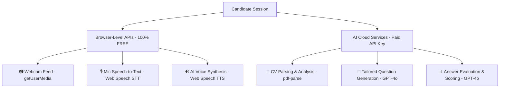

# 📋 NextHire AI — Client API & Architecture Explanation

Dear Client,

Here is the exact explanation of the system architecture, hardware integrations, and API key requirements for our **AI Mock Interview & CV Preparation** application.

---

## 🗺️ Architectural Summary: Free vs. Paid Features

To keep operational costs minimal, the platform splits its features into **Free Browser-Level Integrations** (zero-cost to you) and **Advanced AI Cloud Integrations** (pay-as-you-go).

---

## 1. ⚙️ Free Integrations (Zero Cost, No Key Needed)

These components leverage the candidate's local browser capability. They do not run in the cloud, ensuring **no database load, no server cost, and absolute user privacy**:

*   **Camera Integration (Webcam Feed):** Opened via the HTML5 `getUserMedia()` API. The video runs directly on the device and is mirrored locally. It never leaves the browser.
*   **Speech-to-Text (Candidate Speaks):** Captured using the browser's built-in `SpeechRecognition` API. This converts spoken responses into text locally in real-time.
*   **Text-to-Speech (AI Assistant Speaks):** Powered by the browser's native `SpeechSynthesis` engine. It matches the language selected (French, Spanish, German, Arabic, English, etc.) and uses high-quality default local voices (like Samantha or Alex) to speak the questions.

---

## 2. 🤖 Paid Cloud Integrations (OpenAI API Key Required)

While recording video and sound is handled by the browser, **intelligence** is processed by the cloud. An **OpenAI API Key** is required to run the following advanced features:

*   **Requirement 1: CV Reading & Comprehension**
    *   *Why we need it:* A standard parser only reads raw text. OpenAI's GPT-4o analyzes that raw text to understand the candidate's career trajectory, key skills, gaps, and achievements.
*   **Requirement 2: Custom Question Generation**
    *   *Why we need it:* The system generates exactly 15 questions: **10 questions** built directly from the candidate's specific work history, and **5 questions** built around the target job description. This level of personalization is impossible without a Large Language Model (LLM).
*   **Requirement 3: Professional Grading & Feedback**
    *   *Why we need it:* After each answer, GPT-4o grades the response from 1 to 10 against an industry-standard ideal response outline, providing constructive feedback on how the candidate can structure their answer better.

---

## 💰 Operational Cost Breakdown

OpenAI APIs are priced purely on usage (pay-as-you-go). There is **no monthly subscription fee**.

| Service | Estimated Cost / Token Rate | Total Cost per Interview Session |
|---|---|---|
| **GPT-4o API** | $2.50 per 1 million input tokens $10.00 per 1 million output tokens | **$0.02 – $0.05 USD** |

*   **100 Interview Sessions:** ~$3.00 – $5.00 USD total.
*   **1,000 Interview Sessions:** ~$30.00 – $50.00 USD total.
*   **Development/Testing:** OpenAI offers a **$5.00 USD free credit** upon signing up, which is enough to run approximately 100-150 full test interviews during the building phase.

---

## 🔒 Privacy & Safety Note
Because the webcam and candidate microphone streams are captured and played **locally in the browser**, we do not upload massive video/audio files to our servers. Only clean text (the CV text and the candidate's transcribed answers) is sent to the OpenAI API for evaluation. This drastically reduces server storage costs and keeps candidate security at standard-compliance levels.
